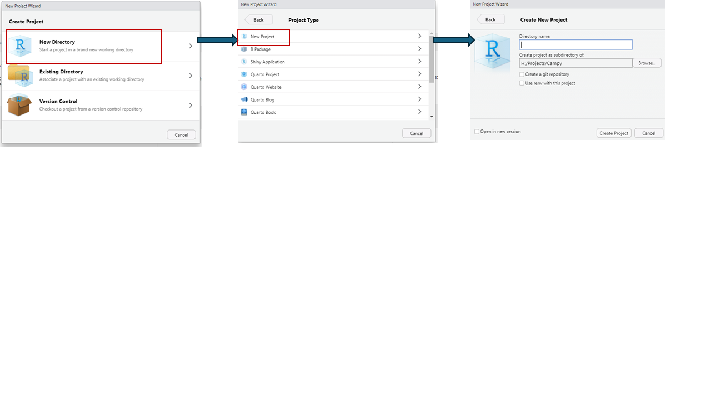

```{r setup, include=FALSE}
knitr::opts_chunk$set(echo = TRUE)
```
## R basics

**Setting up an R project**


Links to tutorials
See https://julhas.com/blog/amr-data-analysis-using-r 

Functions - the three important parts of a function are 1) the name, 2) the argument, 3) the result
Us the funtion args() to specify the arguments of a function.

Installing and loading packages

```{r}
library(AMR)
library(tidyverse)
library(readxl)
```

Objects
Assignments


To find out the arguments of a function use ?

E.g. ?read.csv

## Tidying data

Read in your data.

```{r read}
ecoli <- read_excel("data/bh_AMR_Surveillance_data.xlsx", sheet = "E.coli")
campy <- read_csv("data/Campylobacter_117.csv")

```
We get this error because R does not like certain characters. What is the character? 

```{r}
campy <- read.csv("data/Campylobacter_117v2.csv", header = TRUE)

campy <- read_csv("data/Campylobacter_117v2.csv")
```

Other recommendations for column names / "tidy data" are:

* Keep names simple
* Use an underscore _ instead of a space
* Use abbreviated words instead of a symbol. e.g. perc instead of %
* Be consistent between tables e.g. id versus i.d versus ID
* Each variable results in one column
* Each observation results in one row

Checking the structure of your data. This is probably the most important function in R. This gives you information on the number of rows and columns, the names of your columns, the class of each column. 

```{r}
str(ecoli)
colnames(ecoli)
```

Why is column 5 labelled "...5" and column 19 labelled "SIR...19?

Select the columns of interest and rename columns:

```{r}
#Select by column number
select(ecoli, 1:16)

#Select by column name 
select(ecoli, Stratification, 'Location Name', 'Sample type')

#Remove columns                    
ecoli_select <- select(ecoli, !starts_with("SIR"))

#Rename columns
colnames(ecoli_select) <- c("meat_shop", "stratification", "location_name", "GPS_x", "GPS_y", "Date", "sample_type", "sample_collection", "sample_weight_Kg", "sample_source", "farm_category", "slaughter", "transportation", "transport_medium", "transport_with_other_meat", "sample_ID", "FTL_code", "GEN", "CHL", "MEM", "CRO", "CIP",  "FEP", "NAL", "AMP", "TCY", "SXT")

```

In the above I've changed the antibiotic names to their abbreviated form. To check the abbreviation that is used by the AMR package you can use the code: 

```{r}
as.ab("streptomycin")
```

To view all the antibiotics listed in the antibiotics data set from the AMR package

```{r, eval=FALSE}
view(antibiotics)
```

Is there anything else from a first glance of this data that looks incorrect? Here are three other functions that can be used to have a quick look at your data?

```{r}
head(ecoli_select)
tail(ecoli_select)
glimpse(ecoli_select)
summary(ecoli_select)
quantile(ecoli_select$CHL)
table(ecoli_select$meat, useNA = "ifAny")
```

There are methods in R that you can use to format the dates into the same format. Here instead I've re-imported the data so that all the rows have the correct date format and then changed the date column to date format. Ofter dates will come through as class "character". In the example below they are in the POSIXIt data type which is also a date/time data type. However, by using the lubridate function ymd() it is converted to the date data type, which means the package lubridate can then then be used for date analyses. 

```{r}
ecoli <- read_excel("data/bh_AMR_Surveillance_datav2.xlsx", sheet = "E.coli")
#Remove columns starting with SIR, change column names and add a new column with species                    
ecoli_select <- ecoli %>% 
  select(!starts_with("SIR")) %>%
  setNames(c("meat_shop", "stratification", "location_name", "GPS_x", "GPS_y", 
             "date_collection", "sample_type", "sample_collection", "sample_weight_Kg", 
             "sample_source", "farm_category", "slaughter", "transportation", 
             "transport_medium", "transport_with_other_meat", "sample_ID", "FTL_code", 
             "GEN", "CHL", "MEM", "CRO", "CIP", "FEP", "NAL", "AMP", "TCY", "SXT")) %>%
  mutate(species = "Escherichia coli")
  

str(ecoli_select)

#Change to date format
library(lubridate)
ecoli_select$date_collection <- ymd(ecoli_select$date_collection)
```

Next you may want to check whether the same formatting has been used for all observations for specific variables. For example in the farm_category column both a capital "C" and a lowercase "c" has been used for the word commercial. 

```{r}
sort(unique(ecoli_select$location_name))
sort(unique(ecoli_select$farm_category))
sort(unique(ecoli_select$meat_shop))
```

We can then use the mutate function to "commercial" to "Commercial".

```{r}

#The replace function can be used for one replacement
ecoli_select1 <- mutate(ecoli_select, farm_category = replace(farm_category, farm_category == "commercial", "Commercial"))

#case_when() can be used for multiple replacements
ecoli_select2 <-  mutate(ecoli_select, farm_category = case_when(
    farm_category == "Commercial" ~ "commercial",
    farm_category == "Semi-commercial" ~ "semi-commercial",
    TRUE ~ farm_category
  ))

#Alternatively you can change the case

ecoli_select3 <- mutate(ecoli_select, farm_category = str_to_lower(farm_category))
ecoli_select <- mutate(ecoli_select, farm_category = str_to_title(farm_category))
```

## Data validation

Next you will check whether you have any missing values. These are labelled as NA (meaning not available) in R.

```{r}
na <- ecoli_select[!complete.cases(ecoli_select),]
na

na <- campy[!complete.cases(campy),]
na

is.na(campy)

na <- campy[is.na(campy$'Sample ID'), ]
na

#If sum = 0 no missing values
sum(is.na(campy$'Sample ID'))
#If false no values are na
any(is.na(campy$'Sample ID'))
#Will check to see all values meet this conditon
all(campy$Tetracycline > 0)

colSums(is.na(campy))
all(colSums(is.na(campy))=0)

#Look wfor values with specific characteristics
table(ecoli_select$meat_shop %in% c("AM MS", "MG MS", "ML MS"))
```

To remove all rows with missing values you can use the complete.cases function.

```{r}
```

To only remove rows where there are missing values in a specific column you can use the 

```{r}


#drop_na(maths)

```

Alternatively you can remove missing values when applying a function. For example when calculating the mean.

```{r}
```

Next look at whether the distribution of disk diffusion values looks ok. 

```{r}
#Checking what the phenotype looks like, that there were no strange values.
hist(ecoli_select$GEN)
hist(ecoli_select$CHL)
hist(ecoli_select$MEM)
hist(ecoli_select$CRO)
hist(ecoli_select$CIP)
hist(ecoli_select$FEP)
hist(ecoli_select$NAL)
hist(ecoli_select$AMP)
hist(ecoli_select$TCY)
hist(ecoli_select$SXT)


```

## Generating an antibiogram

First the disk diffusion data is converted to "disk" data type and a new column  is generated using the mutate_if() function for the SIR data. Below is also an example of chaining together multiple operations using %>% as a 'pipe'. In the example below the disk diffusion values are converted to S, I or R based on the latest CLSI guidelines. You can change the AMR guideline using the guideline argument e.g. guideline == "CLSI 2023".

```{r}
ecoli2 <- ecoli_select %>%
  mutate(across(GEN:SXT, as.disk))
str(ecoli2)

#To convert disk diffusion values to SIR
ecoli3 <- ecoli2 %>% mutate_if(is.disk, as.sir, guideline = "CLSI")

#To keep disk diffusion columns and add new columns with SIR
ecoli3 <- ecoli2 %>% mutate(across(GEN:SXT, ~ .x, .names = "{.col}_disk")) %>%
  mutate(across(GEN:SXT, ~ as.sir(.x, guideline = "CLSI")))

  
            
```

You can define your own breakpoints:

```{r}
#generating an example dataframe
dat <- data.frame(
  patient_id = c("J3", "J3","J3","J3"),
  date = c("2018-11-21", "2018-04-03", "2018-09-19", "2018-12-10"),
  isolate = c(1,2,3,4),
  microorganism = c("Escherichia coli", "Escherichia coli", "Escherichia coli", "Escherichia coli"),
  CTX = c(27.2, 18.1, 34.0, 19.2),
  TCY = c(6.6, 7.2, 19.3, 17.2),
  STR = c(6.6, 12.5, 7.2, 17.2)
    )

#To define my own breakpoints
dat <- dat %>%
  mutate(across(CTX:STR, as.disk))%>% 
  mutate(STR = case_when(
    STR >= 15 ~ "S",  # Replace with your own breakpoints
    STR < 12 ~ "R",
    TRUE ~ "I"       # Intermediate
  )) %>%
  mutate_if(is.disk, as.sir, guideline = "CLSI")
```

To specify that you want to use the veterinary breakpoints (rather than human).

```{r}
ecoli2 %>% mutate_if(is.disk, as.sir, guideline = "CLSI", breakpoint_type = "animal")

```

Next an antibiogram will be generated:

```{r}

ant <- antibiogram(ecoli3,
            antibiotics = c("GEN", "CHL", "MEM", "CRO", "CIP", 
                           "FEP", "NAL", "AMP", "TCY", "SXT"), 
            ab_transform = "name",
            digits = 1)  # Show one decimal place

ant
```

## Exercise

* Read in the Enterococci and Salmonella excel sheets and assign them to "enterococci" and "salmonella".
* Remove the SIR columns
* Change column names 
* Add a column called species with the appropriate species name (e.g. Enterococcus sp. Salmonella sp.)
* Check the data for multiple types of categorical values, missing values, outliers etc...
* Change the date format


```{r, results='hide'}
enterococci <- read_excel("data/bh_AMR_Surveillance_datav2.xlsx", sheet = "Enterococci")
#Remove columns starting with SIR, change column names and add a new column with species                    
enterococci_select <- enterococci%>% 
  select(!starts_with("SIR")) %>%
  setNames(c("meat_shop", "stratification", "location_name", "GPS_x", "GPS_y", 
             "date_collection", "sample_type", "sample_collection", "sample_weight_Kg", 
             "sample_source", "farm_category", "slaughter", "transportation", 
             "transport_medium", "transport_with_other_meat", "sample_ID", "FTL_code", 
             "CHL", "AMP", "TCY", "ERY", "TGC", "QDA", "VAN", "LNZ")) %>%
  mutate(meat_shop = str_replace_all(meat_shop, "\\.", ""),  # Remove all dots
         meat_shop = str_replace(meat_shop, "Bebak MS", "BK MS"),
         farm_category = str_to_title(farm_category)) %>%
  mutate(species = "Enterococcus sp.")

salmonella <- read_excel("data/bh_AMR_Surveillance_datav2.xlsx", sheet = "Salmonella")
#Remove columns starting with SIR, change column names and add a new column with species                    
salmonella_select <- salmonella%>% 
  select(!starts_with("SIR"), -c(1, 20, 39:40)) %>%
  setNames(c("meat_shop", "stratification", "location_name", "GPS_x", "GPS_y", 
             "date_collection", "sample_type", "sample_collection", "sample_weight_Kg", 
             "sample_source", "farm_category", "slaughter", "transportation", 
             "transport_medium", "transport_with_other_meat", "sample_ID", "FTL_code", "GEN",
             "CHL", "MEM", "CRO", "CIP", "NAL", "AMP", "TCY", "SXT", "ETP")) %>%
  mutate(meat_shop = str_replace_all(meat_shop, "\\.", ""),  # Remove all dots
         meat_shop = str_replace(meat_shop, "Bebak MS", "BK MS"),
         farm_category = str_to_title(farm_category)) %>%
  mutate(species = "Salmonella sp.")

enterococci_select$date_collection <- ymd(enterococci_select$date_collection)
salmonella_select$date_collection <- ymd(salmonella_select$date_collection)
```

Next we will bind the ecoli, enteroccoci and salmonella data frames together.

```{r}

df <- bind_rows(ecoli_select, salmonella_select, enterococci_select)

```

**Exercise**

1. Generate SIR columns for the new df.

```{r, results = FALSE}

df2 <- df %>%
  mutate(across(GEN:VAN, as.disk))


#To keep disk diffusion columns and add new columns with SIR
df3 <- df2 %>% mutate(across(GEN:VAN, ~ .x, .names = "{.col}_disk")) %>%
  mutate(across(GEN:VAN, ~ as.sir(.x, guideline = "CLSI")))
```
2. Generate the following antibiograms:
* For the antibiotics CHL, AMP and TCY

```{r}

ant <- antibiogram(df3,
            antibiotics = c("CHL", "AMP", "TCY"), 
            ab_transform = "name",
            digits = 1)  # Show one decimal place

ant
```

* For the species E. coli

```{r}

ant <- antibiogram(df3,
            mo_transform = "Escherichia coli", ab_transform = "name",
            digits = 1)  # Show one decimal place

ant
```

* For the groups broiler and spent layer (from the variable sample_type) and antibiotics "CHL", "AMP", "TCY" and E. coli

```{r}

ant <- df3 %>% 
  group_by(sample_type) %>%
  antibiogram(antibiotics = c("CHL", "AMP", "TCY"), mo_transform = "Escherichia coli", ab_transform = "name",
            digits = 1)  # Show one decimal place

ant

ant <- df3 %>% 
  group_by(sample_type) %>%
  wisca(antibiotics = c("CHL", "AMP", "TCY"), mo_transform = "Escherichia coli", ab_transform = "name",
            digits = 1)  # Show one decimal place

ant


```{r}
ggplot(ecoli3, aes(x = GEN)) +
  geom_bar(fill = "steelblue", color = "black") +
  labs(
    title = "Frequency of Antimicrobial Interpretations (CTX)",
    x = "GEN Interpretation (S, I, R)",
    y = "Frequency"
  ) +
  theme_minimal()

autoplot(ant)
```
Plotting box plots of disk diffusion distributions and SIR interpretation

```{r}
ggplot(ecoli3,
       aes(x = sample_collection, y = GEN, colour = GEN_SIR)) +
  geom_jitter(width = 0.2, size = 2) +
  geom_boxplot(fill = NA, colour = "grey40") +
  #scale_y_mic() +
  #scale_colour_sir() +
  labs(title = "MIC Distribution and SIR Interpretation",
       x = "Sample Groups",
       y = "disk diffusion zone (mm)")

```


Merging columns

Changing column names

Filtering and selecting data
```{r}
str(clinical_breakpoints)
filter(clinical_breakpoints, mo == "B_ESCHR_COLI")
filter(clinical_breakpoints, mo != "B_ESCHR_COLI")
filter(clinical_breakpoints, mo == "B_ESCHR_COLI" & method == "DISK" & guideline == "CLSI 2023")
filter(clinical_breakpoints, mo == "B_ESCHR_COLI" | mo == "B_ENTRC")

clinical_breakpoints %>%
  mutate(bacteria = mo_fullname()) %>%
  # filtering functions for microorganisms:
  filter(mo_is_gram_negative(),
         mo_is_intrinsic_resistant(ab = "cefotax"))%>%
  select(bacteria,
         aminoglycosides(),
         carbapenems())

```


Grouping and summarising data
```{r}
#Taking the mean for a group, in this case the mean CTX diffusion zone for each region
summarize(group_by(ecoli, Region2), mean(CTXdiff))
#alternatively
ecoli %>% 
  group_by(Region2) %>%
  summarise(mean(CTXdiff))
  
ecoli %>% 
  group_by(Region2) %>%
  summarise(min(CTXdiff))
```
List of antibiotic acronymns with AMR

## Converting disk diffusion zones and MICs

See also https://msberends.github.io/AMR/reference/as.sir.html#arguments 

Defaults to Eucast 2023 guidelines

# Antibiogram tutorial from the AMR package

```{r}
head(example_isolates)
abg <- antibiogram(
  example_isolates,
  add_total_n = TRUE, info = TRUE,
  antibiotics = c(aminoglycosides(), carbapenems()),
  ab_transform = "name"
)

abg

autoplot(abg)


```
Links to the AMR R package
https://cran.r-project.org/web/packages/AMR/AMR.pdf

Links to other useful tutorials

For dates and times see https://r4ds.had.co.nz/dates-and-times.html 

References

Berends et al. AMR: An R Package for Working with Antimicrobial Resistance Data doi: 10.18637/jss.v104.i03